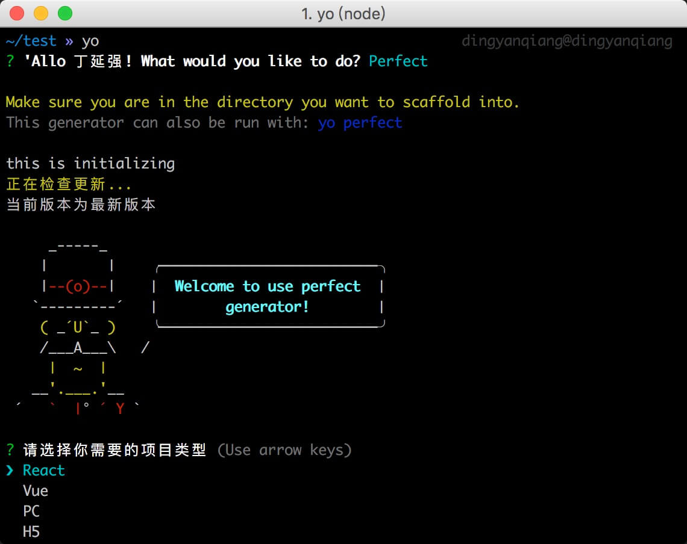

# generator-perfect [![NPM version][npm-image]][npm-url] [![Build Status][travis-image]][travis-url] [![Dependency Status][daviddm-image]][daviddm-url] [![Coverage percentage][coveralls-image]][coveralls-url]
> to working more prefect



## Installation

First, install [Yeoman](http://yeoman.io) and generator-perfect using [npm](https://www.npmjs.com/) (we assume you have pre-installed [node.js](https://nodejs.org/)).

```bash
npm install -g yo
npm install -g generator-perfect
```

Then generate your new project:

```bash
yo perfect
```

## 支持项目类型
 * [X] React
 * [X] Vue
 * [X] PC
 * [X] H5

## 特性

* [X] 可选择Less Lass Css
* [X] 默认开启 CSS moduel
* [X] 热替换(Hot Replace)
* [X] 样式前缀(AutoPrefixer)
* [X] 支持浏览器版本可配置(Browsers Config)
* [ ] TypeScript(TODO)
* [ ] 测试用例(TODO)


## License

MIT © [dingyanqiang](https://github.com/dingyanqiang)


[npm-image]: https://badge.fury.io/js/generator-perfect.svg
[npm-url]: https://npmjs.org/package/generator-perfect
[travis-image]: https://travis-ci.org/dingyanqiang/generator-perfect.svg?branch=master
[travis-url]: https://travis-ci.org/dingyanqiang/generator-perfect
[daviddm-image]: https://david-dm.org/dingyanqiang/generator-perfect.svg?theme=shields.io
[daviddm-url]: https://david-dm.org/dingyanqiang/generator-perfect
[coveralls-image]: https://coveralls.io/repos/dingyanqiang/generator-perfect/badge.svg
[coveralls-url]: https://coveralls.io/r/dingyanqiang/generator-perfect